# Versus for Copilot

<div align="center">

**An adversarial verification layer for GitHub Copilot**

[](https://marketplace.visualstudio.com/items?itemName=JasmineMoreira.versus-for-copilot)
[](https://marketplace.visualstudio.com/items?itemName=JasmineMoreira.versus-for-copilot)
[](./LICENSE)
[](https://github.com/JasmineMoreira)

*Copilot proposes. Versus critiques.*

</div>

---

## The problem no tool solves

In 2025, the METR randomized controlled trial tested 16 experienced developers on 246 real tasks using Cursor Pro with Claude 3.5/3.7 Sonnet. Before starting, developers predicted AI would speed them up by 24%. After use, they believed they had been 20% faster.

**Objective measurement: they were 19% slower.**

A 39-percentage-point gap between perception and reality — not because of the tool, but because of how it was used.

The same year, 10.3% of applications on Lovable's showcase had critical security flaws. An engineer compromised multiple applications in 47 minutes. The cause: AI-generated code that looked correct but was not verified.

### Why every AI coding tool has this problem

Every LLM — Claude, GPT, Gemini, Codestral — operates as a stochastic generator:

```
P(tokenₙ | token₁, ..., token_{n-1})
```

Output is optimized for **statistical plausibility**, not correctness. The model has no internal mechanism to evaluate whether what it produces is semantically, logically, or functionally correct. This is not a limitation of any specific tool. It is a structural property of the architecture.

```
Without verification layer:

prompt → Copilot → suggestion → you accept → shipped

The verification gap is open. Errors are invisible until production.
```

**The distinction is not between tools. It is between two modes of operation.**

---

## What Versus does

Versus implements a **structured adversarial critique layer** on top of GitHub Copilot suggestions, based on the [IACDM methodology](#the-theory-behind-versus-iacdm).

Instead of asking "is this suggestion good?", Versus applies specialized critical lenses to each Copilot suggestion — systematically, before you accept.

```
With Versus:

prompt → Copilot → suggestion → Versus critiques → you decide → shipped

The verification gap is closed at the source.
```

### The adversarial critique model

```mermaid
flowchart LR
    A[👤 Developer] -->|prompt| B["🤖 Copilot<br/>Generative Agent"]
    B -->|suggestion| C{"⚔️ Versus<br/>Adversarial Layer"}
    C -->|Assumptions lens| D["🔍 What does this<br/>assume without declaring?"]
    C -->|Architectural lens| E["🏗️ Can each part be<br/>tested in isolation?"]
    C -->|Implementability lens| F["⚙️ Is the scope<br/>explicit enough?"]
    C -->|Contextual lenses| G["🔒 Security<br/>⚡ Performance<br/>📋 Compliance"]
    D & E & F & G --> H[📊 Critique Report]
    H --> A
```



The generative agent (Copilot) and the verification agent (Versus) are **structurally separated**. This is not cosmetic — it is a fundamental property. An agent cannot reliably verify its own output. Verification must always be external.

---

## Critical lenses

Versus applies two categories of lenses: universal (every suggestion) and contextual (activated by project signals).

### Universal lenses

| Lens | Core question | Failure class it catches |
|------|--------------|--------------------------|
| **Assumptions** | What does this suggestion assume without declaring? | Hidden premises (Leveson, 2011) |
| **Architectural** | Can each part be replaced, removed, or tested in isolation? | Hidden coupling, circular dependencies, SRP violations |
| **Implementability** | Is this scope executable in a single, focused session? | Underspecified interfaces, implicit dependencies |

### Contextual lenses

| Lens | Activated when | Core question |
|------|---------------|---------------|
| **Security** | Exposed APIs, sensitive data, auth flows | How would an attacker exploit this surface with minimal effort? |
| **Performance** | High-compute, real-time, large data volumes | Where are the bottlenecks and what is the asymptotic behavior? |
| **Scientific** | Specialized domain, numerical parameters | Does every value, formula, and algorithm have a verifiable source? |
| **Regulatory** | Applicable standards (ISO, GDPR, HIPAA, etc.) | Does every normative requirement trace to a module? |

### Lens selection principle

> A lens is legitimate only if removing it exposes a class of failure that no other lens would detect. Redundancy disguised as rigor is not rigor.

---

## The coverage matrix

For each critique session, Versus produces a **coverage matrix** — a bidimensional map (suggestions × lenses) showing finding distribution by severity.

```mermaid
flowchart LR
    F["📋 Finding"] --> S1["🔴 Critical<br/>Zero tolerance<br/>Block acceptance"]
    F --> S2["🟡 Important<br/>Explicit decision<br/>Resolve or accept risk"]
    F --> S3["🟢 Suggestion<br/>Can be deferred<br/>Address in next iteration"]

    style S1 fill:#7a1a1a,color:#fff,stroke:#c0392b
    style S2 fill:#7a5c00,color:#fff,stroke:#f39c12
    style S3 fill:#1a4a2a,color:#fff,stroke:#27ae60
```



| Severity | Color | Action |
|----------|-------|--------|
| 🔴 Critical | Red | Block acceptance. Requires resolution. |
| 🟡 Important | Yellow | Explicit decision required: resolve or accept risk with justification. |
| 🟢 Suggestion | Green | Can be deferred without blocking. |

The matrix makes visible **second-order information** that generic review misses:

- **Concentration by suggestion**: a suggestion with findings across all lenses is likely conceptually flawed, not just syntactically.
- **Concentration by lens**: a lens finding issues everywhere indicates a systemic failure.

---

## The verification gap model

The formal model behind Versus defines two agent types:

```mermaid
flowchart TD
    subgraph GA["Generative Agent (GA)"]
        direction TB
        G1[Receives prompt]
        G2[Generates artifact]
        G3["❌ Cannot verify<br/>own output"]
        G1 --> G2 --> G3
    end

    subgraph VA["Verification Agents (VA)"]
        direction TB
        VA1["🤖 VA-Automatic<br/>linters · type checkers · tests"]
        VA2["👤 VA-Human<br/>operator judgment"]
    end

    GA -->|artifact| VA
    VA -->|concrete feedback| GA
    VA -->|approved| SHIP[✅ Delivered]
    VA -->|rejected| GA
```



**Key property:** When a VA rejects an artifact and provides concrete error feedback, the next generation by the GA is conditioned on **empirical evidence of failure** — qualitatively superior to the original prompt. This is the reconditioning mechanism.

---

## The theory behind Versus: IACDM

Versus is the practical implementation of the **adversarial critique phase** within IACDM — *Interactive Adversarial Convergence Development Methodology* — a structured framework for AI-assisted software development.

IACDM was developed and validated in production R&D projects (2025–2026) and rests on three central theses:

> **Thesis 1:** The quality of AI-assisted software is determined by the quality of the design that precedes code generation, not by the model's generative capability.
>
> **Thesis 2:** AI is most productive when operating on granular work units with explicit scope, documented assumptions, and well-defined interfaces.
>
> **Thesis 3:** Deep understanding of the problem is a precondition for any technical decision. Understanding the wrong problem is orders of magnitude more expensive than understanding it slowly.

### The 8-phase IACDM cycle

```mermaid
flowchart TD
    subgraph row1["Design"]
        P0["0 · Problem Discovery"] --> P1["1 · Architecture"]
        P1 --> P2["⚔️ 2 · Adversarial Critique"]
        P2 --> P3["3 · Simplification"]
        P3 -->|"Δ ≥ 15% or critical"| P2
    end

    subgraph row2["Build"]
        P4["4 · Convergence Gate"] --> P5["5 · Code Implementation"]
        P5 --> P6["6 · Tests"]
        P6 --> P7["7 · Post-Review"]
    end

    P3 -->|"Δ < 15%, zero critical"| P4

    style P2 fill:#4a1942,color:#fff,stroke:#9b59b6
    style row1 fill:#111,stroke:#444
    style row2 fill:#111,stroke:#444
```



**Versus operates primarily at Phase 2** — the adversarial critique layer that attacks each architectural decision with specialized lenses before any code is written or accepted.

The full IACDM technical foundation is documented in:

📄 **[IACDM: Interactive Adversarial Convergence Development Methodology — Technical Foundation v2](./docs/iacdm_technical_foundation_v2_en.md)**

*Jasmine Moreira, 2025–2026*

---

## Design decisions

**Why adversarial instead of collaborative?**

LLMs trained with RLHF have a documented bias toward agreement. When asked "is this design good?", the model tends to say yes. This is what Argyris (1977) called *single-loop learning* — acting without questioning the action.

Versus enforces *double-loop learning*: it questions not just the solution, but the assumptions that sustain it. The prompt posture is explicitly adversarial: find what is wrong, not confirm what is right.

**Why lenses instead of a single critique pass?**

Generic critique ("attack this suggestion") produces superficial and uniform observations. The same LLM operates all passes — without operationally distinct criteria, diversification is illusory. Specialized lenses with binary criteria constitute functionally distinct verification agents, even when operated by the same model.

This maps directly to ATAM (Kazman et al., 2000): different evaluators attack through distinct quality attributes, but trade-offs are resolved by a single entity maintaining systemic vision.

**Why is the verification agent always external?**

This is not a design choice — it is a structural constraint. A model cannot reliably verify its own output. Self-correction in LLMs has been shown to degrade without external feedback (Huang et al., 2023). The separation between GA and VA is the methodological core that makes verification meaningful.

---

## Installation

Install directly from the VS Code Marketplace:

```
ext install JasmineMoreira.versus-for-copilot
```

Or search **"Versus for Copilot"** in the Extensions panel.

**Requirements:** VS Code 1.85+, GitHub Copilot extension active.

---

## Roadmap

- [ ] Custom lens definition (project-specific critique criteria)
- [ ] Coverage matrix export (JSON / Markdown)
- [ ] Gate history — track finding evolution across sessions
- [ ] Team mode — shared lens configuration via `.versus/config.json`
- [ ] Integration with IACDM `specs/` knowledge repository

---

## Methodology references

The lenses and critique model implemented in Versus are grounded in:

- Argyris, C. (1977). Double loop learning in organizations. *Harvard Business Review*.
- Brooks, F. (1987). No Silver Bullet. *Computer*, 20(4).
- Huang, J. et al. (2023). Large Language Models Cannot Self-Correct Reasoning Yet. *arXiv:2310.01798*.
- Kazman, R. et al. (2000). ATAM: Method for Architecture Evaluation. *SEI/CMU*.
- Leveson, N. (2011). *Engineering a Safer World*. MIT Press.
- METR (2025). Measuring the Impact of Early-2025 AI on Experienced Developer Productivity. *arXiv:2507.09089*.
- Popper, K. (1959). *The Logic of Scientific Discovery*. Hutchinson.

Full reference list in the [IACDM technical document](./docs/iacdm_technical_foundation_v2_en.md#references).

---

## Author

**Jasmine Moreira**
Developer · Researcher · IACDM creator

[](https://marketplace.visualstudio.com/publishers/JasmineMoreira)

---

## License

This software is proprietary. The code is not open source.

The IACDM methodology documentation is made available for research and educational purposes. See [LICENSE](./LICENSE) for details.

---

<div align="center">

*"A converged design is not a finished design,*
*but one that is certainly ready to evolve."*

— IACDM Technical Foundation, Jasmine Moreira

</div>
